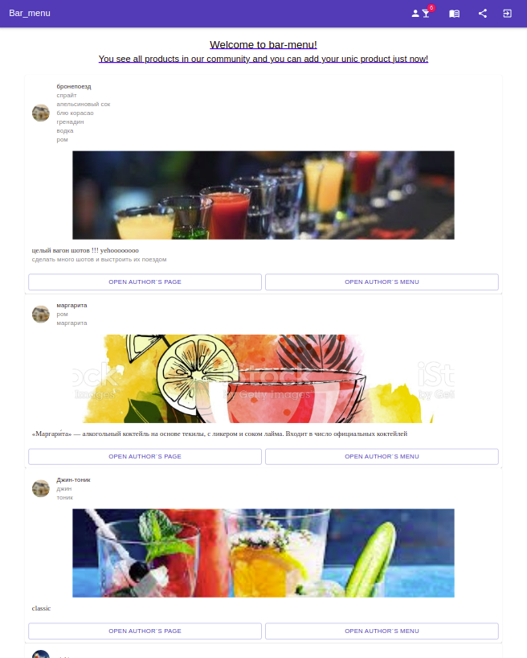
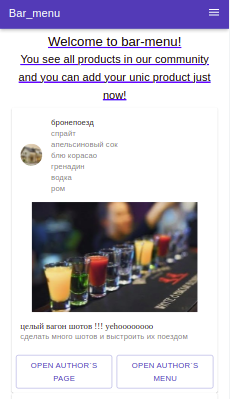
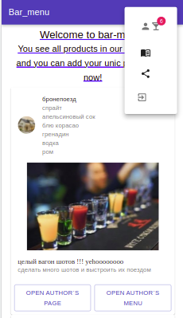

# bar-menu
the app allows you to view cocktail recipes, create your own, keep track of the ingredients in your bar and share your menu with your friends (just like in a real bar)

FRONTEND - react + redux

BACKEND - node + express

style - materialUI

---
## what's inside

main page contains a list of all cocktails with the ability to go to the author's page or see the cocktail menu of this author
​

to view the photo of the cocktail, you can open the modal window
​

---
## mobile view

​
​

